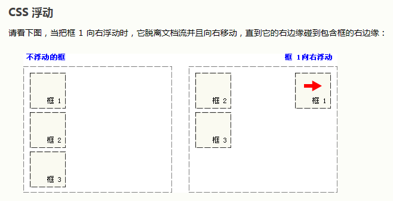
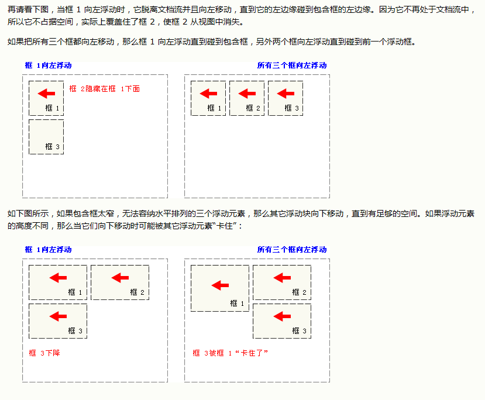

# CSS基础语法

---

## CSS语法

css规则由两个主要部分构成：**选择器** ，**一条或多条声明**。

``` CSS
selector{declaration1;declaration2;... declarationN}
```

每条声明由一个属性和一个值组成

```CSS
selector{property:value}
h1{color:red; font-size:14px;}
```

```CSS
p{color:#ff0000;}
p{color:#f00;}
p{color:rgb(255,0,0);}
p{color:rgb(100%,0%,0%);}
```

每行只描述一个属性，可增强可读性

```CSS
p{
    text-align:center;
    color:black;
    font-family:arial;
}
```

```csss
body {
  color: #000;
  background: #fff;
  margin: 0;
  padding: 0;
  font-family: Georgia, Palatino, serif;
  }

```

是否包含空格不会影响 CSS 在浏览器的工作效果，同样，与 XHTML 不同，CSS 对大小写不敏感。不过存在一个例外：<u>如果涉及到与 HTML 文档一起工作的话，class 和 id 名称对大小写是敏感的</u>。

---

##  CSS派生选择器

派生选择器允许你根据上下文关系来确定某个标签的样式。通过合理的使用派生选择器，我们可以使HTML代码变得更加整洁。

例如，希望列表中的strong元素变为斜体字，而不是通常的粗体字，可以这样定义一个派生选择器：

```CSS
li strong{
    font-style: italic;
    font-weigth: normal;
}
```


```html
<p><strong>我是粗体字，不是斜体字，因为我不在列表当中，所以这个规则对我不起作用</strong></p>

<ol>
<li><strong>我是斜体字。这是因为 strong 元素位于 li 元素内。</strong></li>
<li>我是正常的字体。</li>
</ol>
```

---

## CSS id选择器

<u>id选择器可以为标有特定id的HTML元素指定特定的样式。</u>

id选择器可以“#”来定义。

```CSS
#red{color: red;}
#green{color: green;}

<p id="red"> this paragraf is red. </p>
<p id="green"> this paragraph is green. </p>
```

注意：id属性只能在每个HTML文档中出现一次。

单独的选择器

id选择器即使不被用来创建派生选择器，它也可以独立发挥作用

```CSS
#sidebar{
    border: 1px dotted #000;
    padding: 10px;
}
```

id为sidebar的元素将拥有一个像素宽的黑色点状边框，同时其周围会有10个像素宽的内边距（padding，内部空白）。

---

## CSS类选择器

在CSS中，类选择器以一个点号显示：

```CSS
.center{text-align: center}
```

⬆️所有的center类的HTML元素均为居中。

⬇️h1和p元素都有center类。

```CSS
<h1 class="center">
This heading will be center-aligned
</h>

<p class="center">
This paragraph will also be center-aligned.
</p>
```

注意：类名的第一个字符不能为数字！它无法在Mozilla或Firefox中起作用。

和id一样，class也可被用作派生选择器

```CSS
.fancy td{
    color:#f60;
    background:#666;
}
```

⬆️类名为 fancy 的更大的元素内部的表格单元都会以灰色背景显示橙色文字。（名为 fancy 的更大的元素可能是一个表格或者一个 div）

元素也可以基于他们的类而被选择：

```CSS
td.fancy{
    color: #f60;
    background: #666;
}
```

---

## CSS属性选择器

对带有指定属性的HTML元素设置样式。

可以为拥有指定属性的HTML元素设置样式，而不仅限于class和id属性

注释：只有在规定了！DOCTYPE时，IE7和IE8才支持属性选择器。在IE6及更低版本中，不支持属性选择。

属性选择器

⬇️为带有title属性的所有元素设置样式：

```CSS
[title]
{
    color:red;
}
```

⬇️单独含有hello字符

```CSS
[title~=hello]{color:red;}
```

⬇️包含指定的lang属性

```CSS
[lang|=en]{color:red;}
```

设置表单的样式

```CSS
<!DOCTYPE html PUBLIC "-//W3C//DTD XHTML 1.0 Transitional//EN" "http://www.w3.org/TR/xhtml1/DTD/xhtml1-transitional.dtd">
<html>
<head>
<style>
input[type="text"]
{
  width:150px;
  display:block;
  margin-bottom:10px;
  background-color:yellow;
  font-family: Verdana, Arial;
}

input[type="button"]
{
  width:120px;
  margin-left:35px;
  display:block;
  font-family: Verdana, Arial;
}
</style>
</head>
<body>

<form name="input" action="" method="get">
<input type="text" name="Name" value="Bill" size="20">
<input type="text" name="Name" value="Gates" size="20">
<input type="button" value="Example Button">

</form>
</body>
</html>

```


---

## CSS 选择器参考手册

| 选择器                                                       | 描述                                                         |
| ------------------------------------------------------------ | ------------------------------------------------------------ |
| [[*attribute*\]](http://www.w3school.com.cn/cssref/selector_attribute.asp) | 用于选取带有指定属性的元素。                                 |
| [[*attribute*=*value*\]](http://www.w3school.com.cn/cssref/selector_attribute_value.asp) | 用于选取带有指定属性和值的元素。                             |
| [[*attribute*~=*value*\]](http://www.w3school.com.cn/cssref/selector_attribute_value_contain.asp) | 用于选取属性值中包含指定词汇的元素。                         |
| [[*attribute*\|=*value*\]](http://www.w3school.com.cn/cssref/selector_attribute_value_start.asp) | 用于选取带有以指定值开头的属性值的元素，该值必须是整个单词。 |
| [[*attribute*^=*value*\]](http://www.w3school.com.cn/cssref/selector_attr_begin.asp) | 匹配属性值以指定值开头的每个元素。                           |
| [[*attribute*$=*value*\]](http://www.w3school.com.cn/cssref/selector_attr_end.asp) | 匹配属性值以指定值结尾的每个元素。                           |
| [[*attribute**=*value*\]](http://www.w3school.com.cn/cssref/selector_attr_contain.asp) | 匹配属性值中包含指定值的每个元素。                           |

---

## 如何创建CSS

### 如何插入样式表

1. 外部样式表

   当样式需要应用于很多页面时，外部样式表将是理想的选择，在使用外部样式表的情况下，可以通过改变一个文件夹改变整个站点的外观。每个页面使用link标签链接到样式表。

   ```css
   <head>
   <link rel="stylesheet" type="text/css" href="mystyle.css"/>
   </head>
   ```

   **不要在属性值和单位之间留有空格。**

2. 内部样式表

   ```CSS
   <head>
   <style type="text/css">
   hr{color:sienna;}
   p{margin-left: 20px;}
   body{background-image:url("image/back40.gif");}
   </style>
   </head>
   ```

3. 内联样式

   **当样式仅需要在一个元素上应用一次时使用**

   ```css
   <p style="color:sienna;margin-left:20px">
   This is a paragraph.
   </p>
   ```

4. 多重样式

   如果某些属性在不同的样式表中被同样的选择器定义，那么属性值将从更具体的样式表中继承过来。

   ```css
   h3{
       color:red;
       text-align:left;
       font-size:8pt;
   }
   ```

   与此同时，内部样式拥有针对h3选择器的两个属性：

   ```css
   h3{
       text-align:right;
       font-size:20pt;
   }
   ```

   同时定义，h3样式为：

   ```css
   color:red;
   text-align:rigth;
   font-size:20pt;
   ```

   **<u>即颜色属性将被继承于外部样式表</u>，而文字排列（text-alignment）和字体尺寸（font-size）会被内部样式表中的规则取代。**


---


   # CSS样式


   ## CSS背景

   **CSS允许应用纯色作为背景，也允许使用背景图像创建相当复杂的效果。**

---

  ### 背景色  <u>background-color</u>

   ```CSS
   p {background-color: gray; padding: 20px}
   ```

可以为所有元素设置背景色，这包括 body 一直到 em 和 a 等行内元素。

background-color不能继承，其默认值是transparent。有透明之意。

### 背景图像  <u>background-image</u>

属性默认值为none，如果需要设置一个背景图像，必须为这个属性这是一个URL值。

```CSS
body{background-image:url(/i/eg_bg_0.gif);}
```

大多数背景都应用到body元素，并不仅限于此。

```css
p.flower{background-image:url(/i/eg_bg_03.gif);}
```

所有的背景属性都不能继承。

### 背景重复	<u>background-repead</u>

```CSS
body{
    background-image:url(/i/eg_bg_03.gif);
    background-repead: repeat-y;
}
```

### 背景定位	<u>background-position</u>

改变图片在背景中的位置

```CSS
body{
    background-image:url('/i/eg_bg_03.gif');
    background-repead:no-repeat;
    background-position:center;
}
```

为 background-position 属性提供值有很多方法。首先，可以使用一些关键字：==top、bottom、left、right 和 center==。通常，这些关键字会成对出现，不过也不总是这样。还可以使用长度值，如 100px 或 5cm，==最后也可以使用百分数值==。不同类型的值对于背景图像的放置稍有差异。

### 关键字

```css
p{
    background-image:url('bgimg.gif');
    background-repead:no-repeat;
    background-position:top;
}
```

| 单一关键字 | 等价的关键字                   |
| ---------- | ------------------------------ |
| center     | center ==center==              |
| top        | top ==center== 或 center top   |
| bottom     | bottom center 或 center bottom |
| right      | right center 或 center right   |
| left       | left center 或 center left     |

默认缺省值为center。

### 百分数值

```css
body{
    background-image:url('/i/eg_bg_03.gif');
    background-repeat:no-repeat;
    background-position:50% 50%;
}
```

这会导致图像适当放置，其中心与其元素的中心对齐。**换句话说，百分数值同时应用于元素和图像。**

### 长度值

Background-position: 50px 100px

### 背景关联

如果文档比较长，那么当文档向下滚动时，背景图像也会随之滚动。当文档滚动到超过图像的位置时，图像就会消失。

您可以通过 [background-attachment 属性](http://www.w3school.com.cn/cssref/pr_background-attachment.asp)防止这种滚动。通过这个属性，可以声明图像相对于可视区是固定的（fixed），因此不会受到滚动的影响：

```CSS
body{
    background-image:url('/i/eg_bg_02.gif');
    background-repeat:no-repeat;
    background-attachment:fixed;
}
```

Background-attachment属性的默认值是scroll。

---


## CSS文本

**CSS文本属性可定义文本的外观。**

通过文本属性，可以改变文本的颜色、字符间距，对齐文本，装饰文本，对文本进行缩进等。

---

#### 缩进文本

第一行进行缩进，CSS提供了 <u>text-indent属性</u>

```CSS
p{text-indent:5em;}
```

**注意**：一般来说，可以为所有块级元素应用 text-indent，但==无法将该属性应用于行内元素==，图像之类的替换元素上也无法应用 text-indent 属性。不过，如果一个块级元素（比如段落）的首行中有一个图像，它会随该行的其余文本移动。

提示：如果想把一个行内元素的第一行“缩进”，==可以用左内边距或外边距创造这种效果。==

在为 text-indent 设置==负值==时要当心，如果对一个段落设置了负值，那么首行的某些文本可能会超出浏览器窗口的左边界。为了避免出现这种显示问题，建议针对负缩进再设置一个外边距或一些内边距：

```css
p{text-indent:-5em; padding-left:5em;}
```

#### 使用百分比值

text-indent 可以使用所有长度单位，包括百分比值。

```css
div{width: 400px;}
p {text-indent: 20%;}

<div>
<p> this is a paragraph.</p>
</div>
```

#### 继承

text-indent属性可以继承。

```css
div#outer {width: 500px;}
div#inner {text-indent: 10%;}
p {width: 200px;}

<div id = "outer">
<div id = "inner">some text. some text. some text.
<p>this is a paragraph.</p>
</div>
</div>
```

#### 水平对齐

<u>text-align</u>是一个基本的属性，他会影响一个元素中的文本行互相之间的对齐方式。前三个值相当直接。

值left、right和center会导致元素中的文本分别左对齐，右对齐和居中。

==西方语言从左向右，希伯来语和阿拉伯语从右向左==

**text-align:center与<CENTER>**

**<CENTER>**不但影响文本，还会把整个元素居中。text-align不会控制元素的对齐，只影响内部内容。元素本身不会从一段移动到另一端，只是其中的文本受影响。

**justify**

最后一个水平对齐属性是justify。使文本两头对齐。

#### 字间隔

<u>word-spacing属性</u>可以改变字（单词）之间的间隔。默认值normal与0是一样的。

```css
p.spread {word-spacing: 30px;}
p.tight {word-spacing: -0.5em;}

<p class = "spread">
This is a paragraph. The spaces between words will be increased.
</p>

<p class = "tight">
This is a paragraoh. The spaces between words will be decreased.
</p>
```

#### 字母间隔

<u>letter-spacing属性</u>与word-spacing的区别：字母间隔修改的是字符或者字母之间的间隔。

```css
h1 {letter-spacing: -0.5em}
h4 {letter-spacing: 20px}

<h1>This is header 1</h1>
<h4>This is header 4</h4>
```

#### 字符转换

<u>text-transform属性</u>处理文本的大小写

- none
- uppercase
- lowercase
- capitalize

默认值none对文本不做改动。uppercase和lowercase将文本转换为全大写和全小写字符。最后，capitalize只对每个单词的首字母大写。

```css
h1 {text-transform: uppercase}
```

```html
<html>

<head>
<style type="text/css">
  h1 {text-transform: uppercase}
  p.uppercase {text-transform: uppercase}
  p.lowercase {text-transform: lowercase}
  p.capitalize {text-transform: capitalize}
</style>
</head>

<body>
<h1>This Is An H1 Element</h1>
<p class="uppercase">This is some text in a paragraph.</p>
<p class="lowercase">This is some text in a paragraph.</p>
<p class="capitalize">This is some text in a paragraph.</p>
</body>

</html>
```

#### 文本装饰

<u>text-decration</u>

- none
- underline
- overline
- line-through
- blink

#### 处理空白符

<u>white-space</u>

```css
p {white-space: normal;}
<p>
This      paragraph has    
many space   in     it.
</p>
```

- normal    忽略空白符
- pre          空白符不会被忽略
- nowrap   防止换行
- pre-line   空白符忽略，允许换行
- pre-wrap  空白符不被忽略，允许换行

#### 文本方向

<u>derection</u>

ltr和rtl，默认ltr

## CSS字体

除了各种特定的字体系列外，CSS 定义了 5 种通用字体系列：

- Serif 字体
- Sans-serif 字体
- Monospace 字体
- Cursive 字体
- Fantasy 字体

使用一种sans-serif字体，不关心是哪一种字体

```css
body {font-family: sans-serif;}
```

指定字体：

```css
h1 {font-family: Georgia;}
```

没有安装Georgia字体

```css
h1 {font-family: Georgia, serif;}
```

如果您对字体非常熟悉，也可以为给定的元素指定一系列类似的字体。要做到这一点，需要把这些字体按照优先顺序排列，然后用逗号进行连接：

```css
p {font-family: Times, TimesNR, 'New Century Schoolbook',Georgia, 'New York', serif;}
```

#### 使用引号

只有当字体名中有一个或多个空格（比如New York），或者如果字体名包括#或$之类的符号，才需要在font-family声明中加引号。

单引号或双引号都可以接受。但是，如果把一个 font-family 属性放在 HTML 的 style 属性中，则需要使用该属性本身未使用的那种引号：

```css
<p style="font-family: Times, TimesNR, 'New Century Schoolbook', Georgia,'New York', serif;">...</p>
```

#### 字体风格

<u>font-style</u>最常用于规定斜体文本

- normal - 文本正常显示
- italic - 文本斜体显示
- oblique - 文本倾斜显示

斜体（italic）是一种简单的字体风格，对每个字母的结构有一些小改动，来反映变化的外观。与此不同，倾斜（oblique）文本则是正常竖直文本的一个倾斜版本。

通常情况下，italic 和 oblique 文本在 web 浏览器中看上去完全一样。

#### 字体变形

<u>font-variant</u>设定小型大写字母

```css
p {font-variant: small-caps;}
```

#### 字体加粗

<u>font-weight</u>设置文本的粗细

100 ~ 900 设置9级加粗度，400等价于normal，700等价于bold。

```css
p.normal {font-weigth: normal;}
p.thick {font-weigth: bold;}
p.thicker {font-weight: 900;}
```

#### 字体大小

<u>font-size</u>

值可以是绝对或者相对

绝对值：

- 将文本设置为指定的大小
- 不允许用户在所有的浏览器中改变文本的大小（不利于可用性）
- 绝对大小在确定了输出的物理尺寸时很有用

相对大小：

- 相对于周围的元素来设置大小
- 允许用户在浏览器改变文本大小

**注意**：如果没有规定字体大小，普通文本的默认大小是16像素（1em）

```css
h1 {font-size: 60px;}
h2 {font-size: 40px;}
p {font-size: 14px;}
```

（注：16 等于父元素的默认字体大小，假设父元素的 font-size 为 20px，那么公式需改为：*pixels*/20=*em*）

```css
h1 {font-size:3.75em;} /* 60px/16=3.75em */
h2 {font-size:2.5em;}  /* 40px/16=2.5em */
p {font-size:0.875em;} /* 14px/16=0.875em */
```

**结合使用百分比和EM**

在所有浏览器中均有效的方案是为 body 元素（父元素）以百分比设置默认的 font-size 值：

```css
body {font-size:100%;}
h1 {font-size:3.75em;}
h2 {font-size:2.5em;}
p {font-size:0.875em;}
```

## CSS链接

#### 设置链接的样式

链接的特殊性在于能够根据他们所处的状态来设置他们的样式。

链接的四种状态：

- a:link - 普通的、未被访问的链接
- a:visited - 用户已访问的链接
- a:hover - 鼠标指针位于链接的上方
- a:active - 链接被点击的时刻

```css
a:link {color: #FF0000;}      /*未被访问的链接*/
a:visited {color: #00FF00;}	  /*已访问*/
a:hover {color: #FF00FF;}	  /*鼠标指针移动到链接上*/
a:active {color: #0000FF;}	  /*点击*/
```

当为链接的不同状态设置样式时，请按照以下次序规则：

- a:hover 必须位于 a:link 和 a:visited 之后
- a:active 必须位于 a:hover 之后

#### 去掉下划线

```css
a:link {text-decoration:none}
```

#### 背景色

```css
a:link {background-color: #B2FF99;}
```


## CSS列表

#### CSS列表属性

| 属性                | 描述                       |
| ------------------- | -------------------------- |
| list-style          | 简写属性                   |
| list-style-image    | 图像设置为列表项标志       |
| list-style-position | 设置列表中列表项标志的位置 |
| list-style-type     | 设置列表项标志的类型       |
|                     |                            |

#### CSS列表实例

**所有的列表样式类型**

```html
<html>
<head>
<style type="text/css">
ul.none {list-style-type: none}
ul.disc {list-style-type: disc}
ul.circle {list-style-type: circle}
ul.square {list-style-type: square}
ul.decimal {list-style-type: decimal}
ul.decimal-leading-zero {list-style-type: decimal-leading-zero}
ul.lower-roman {list-style-type: lower-roman}
ul.upper-roman {list-style-type: upper-roman}
ul.lower-alpha {list-style-type: lower-alpha}
ul.upper-alpha {list-style-type: upper-alpha}
ul.lower-greek {list-style-type: lower-greek}
ul.lower-latin {list-style-type: lower-latin}
ul.upper-latin {list-style-type: upper-latin}
ul.hebrew {list-style-type: hebrew}
ul.armenian {list-style-type: armenian}
ul.georgian {list-style-type: georgian}
ul.cjk-ideographic {list-style-type: cjk-ideographic}
ul.hiragana {list-style-type: hiragana}
ul.katakana {list-style-type: katakana}
ul.hiragana-iroha {list-style-type: hiragana-iroha}
ul.katakana-iroha {list-style-type: katakana-iroha}
</style>
</head>

<body>
<ul class="none">
<li>"none" 类型</li>
<li>茶</li>
<li>可口可乐</li>
</ul>

<ul class="disc">
<li>Disc 类型</li>
<li>茶</li>
<li>可口可乐</li>
</ul>

<ul class="circle">
<li>Circle 类型</li>
<li>茶</li>
<li>可口可乐</li>
</ul>

<ul class="square">
<li>Square 类型</li>
<li>茶</li>
<li>可口可乐</li>
</ul>

<ul class="decimal">
<li>Decimal 类型</li>
<li>茶</li>
<li>可口可乐</li>
</ul>

<ul class="decimal-leading-zero">
<li>Decimal-leading-zero 类型</li>
<li>茶</li>
<li>可口可乐</li>
</ul>

<ul class="lower-roman">
<li>Lower-roman 类型</li>
<li>茶</li>
<li>可口可乐</li>
</ul>

<ul class="upper-roman">
<li>Upper-roman 类型</li>
<li>茶</li>
<li>可口可乐</li>
</ul>

<ul class="lower-alpha">
<li>Lower-alpha 类型</li>
<li>茶</li>
<li>可口可乐</li>
</ul>

<ul class="upper-alpha">
<li>Upper-alpha 类型</li>
<li>茶</li>
<li>可口可乐</li>
</ul>

<ul class="lower-greek">
<li>Lower-greek 类型</li>
<li>茶</li>
<li>可口可乐</li>
</ul>

<ul class="lower-latin">
<li>Lower-latin 类型</li>
<li>茶</li>
<li>可口可乐</li>
</ul>

<ul class="upper-latin">
<li>Upper-latin 类型</li>
<li>茶</li>
<li>可口可乐</li>
</ul>

<ul class="hebrew">
<li>Hebrew 类型</li>
<li>茶</li>
<li>可口可乐</li>
</ul>

<ul class="armenian">
<li>Armenian 类型</li>
<li>茶</li>
<li>可口可乐</li>
</ul>

<ul class="georgian">
<li>Georgian 类型</li>
<li>茶</li>
<li>可口可乐</li>
</ul>

<ul class="cjk-ideographic">
<li>Cjk-ideographic 类型</li>
<li>茶</li>
<li>可口可乐</li>
</ul>

<ul class="hiragana">
<li>Hiragana 类型</li>
<li>茶</li>
<li>可口可乐</li>
</ul>

<ul class="katakana">
<li>Katakana 类型</li>
<li>茶</li>
<li>可口可乐</li>
</ul>

<ul class="hiragana-iroha">
<li>Hiragana-iroha 类型</li>
<li>茶</li>
<li>可口可乐</li>
</ul>

<ul class="katakana-iroha">
<li>Katakana-iroha 类型</li>
<li>茶</li>
<li>可口可乐</li>
</ul>

</body>
</html>

```


---

## CSS表格

#### 表格边框

border属性设置表格边框

```css
table, th, td
{
    border: 1px solid blue;
}
```

如果需要把表格显示为单线条边框，请使用 border-collapse 属性。

---

#### 折叠边框

border-collapse设置是否将表格边框折叠为单一边框

```css
table{
    border-collapse: collapse;
}
table, th, td
{
    border: 1px solid black;  /*solid  实线*/
}
```


#### 表格宽度和高度

```css
table
{
    width: 100%;
}

th
{
    height: 50px;
}
```

**HTML表单中有两种类型的单元格**

- 表头单元格 - 包含表头信息（由th元素创建）
- 标准单元格 - 包含数据（由td元素创建）

th元素内部的文本通常会呈现为居中加粗，而td元素内的文本通常是左对齐的普通文本。

 **如果要将内容横跨多个行或列，使用colspan和rowspan属性。**

#### 表格文本对齐

text-align和 vertical-align属性设置表格中文本的对齐方式。

text-align设置水平对齐方式

```css
td{
    text-align: right;
}
```

Vergical-align设置垂直对齐方式

```css
td{
    height: 50px;
    vertical-align: bottom;
}
```

#### 表格内边距

padding属性控制

```css
td{
    padding: 15px;
}
```

#### 表格颜色

```css
table, th, td
{
    border: 1px solid green;
}
th
{
    background-color: green;
    color: white;
}
```

---


## CSS轮廓

---

轮廓（outline）是绘制元素周围的一条线，位于边框边缘的外围，可起到突出元素的作用。

---

 **CSS边框属性**

| 属性          | 描述                           |
| ------------- | ------------------------------ |
| outline       | 在一个声明中设置所有的轮廓属性 |
| outline-color | 轮廓颜色                       |
| outline-style | 轮廓样式                       |
| outline-width | 轮廓宽度                       |

---

# CSS模型框


---

**CSS框模型（Box Model）规定了元素框处理元素内容、<u>内边框</u>、<u>边框</u>、<u>外边距</u>的方式。**


- 内边距 - 内边距呈现元素的背景
- 边框 - 内边距的边缘是边框
- 外边距 - 边框以外是外边距，默认是透明的，不会遮挡其后的任何元素。

内边距、边框和外边距都是可选的，默认值是零。

```css
* {
    margin: 0;
    padding: 0;
}
```


```css
#box{
    width:70px;
    padding: 5px;
    margin: 10px;
}
```

**==提示：==**外边距可以是负值，而且在很多情况下都要用到负值的外边距。

**CSS内边距属性**

| 属性                                                         | 描述                                                 |
| ------------------------------------------------------------ | ---------------------------------------------------- |
| [padding](http://www.w3school.com.cn/cssref/pr_padding.asp)  | 简写属性。作用是在一个声明中设置元素的所内边距属性。 |
| [padding-bottom](http://www.w3school.com.cn/cssref/pr_padding-bottom.asp) | 设置元素的下内边距。                                 |
| [padding-left](http://www.w3school.com.cn/cssref/pr_padding-left.asp) | 设置元素的左内边距。                                 |
| [padding-right](http://www.w3school.com.cn/cssref/pr_padding-right.asp) | 设置元素的右内边距。                                 |
| [padding-top](http://www.w3school.com.cn/cssref/pr_padding-top.asp) | 设置元素的上内边距。                                 |

---

## CSS边框

---

**元素的边框（border）是围绕元素内容和内边距的一条或多条线**

**CSS border属性允许你规定元素边框的样式、宽度和颜色。**

---

每个边框有3个方面：宽度、样式以及颜色。

#### 边框与背景

边框绘制在“元素的背景之上”。

#### 边框的样式

border-style属性定义了10个不同的非inherit样式。

| 值      | 描述                                                         |
| ------- | ------------------------------------------------------------ |
| none    | 定义无边框。                                                 |
| hidden  | 与 "none" 相同。不过应用于表时除外，对于表，hidden 用于解决边框冲突。 |
| dotted  | 定义点状边框。在大多数浏览器中呈现为实线。                   |
| dashed  | 定义虚线。在大多数浏览器中呈现为实线。                       |
| solid   | 定义实线。                                                   |
| double  | 定义双线。双线的宽度等于 border-width 的值。                 |
| groove  | 定义 3D 凹槽边框。其效果取决于 border-color 的值。           |
| ridge   | 定义 3D 垄状边框。其效果取决于 border-color 的值。           |
| inset   | 定义 3D inset 边框。其效果取决于 border-color 的值。         |
| outset  | 定义 3D outset 边框。其效果取决于 border-color 的值。        |
| inherit | 规定应该从父元素继承边框样式。                               |

```css
p {border-style: solid solid solid none;}
p {border-style: solid; border-left-style: none;}
```


#### 边框的宽度

<u>border-width</u>为边框指定宽度

```css
p {border-style: solid; border-width: 5px;}
p {border-style: solid; border-width: thick;}
```


#### 单边宽度

```css
p {border-style: solid; border-width: 15px 5px 15px 5px;}
```

```css
p {
  border-style: solid;
  border-top-width: 15px;
  border-right-width: 5px;
  border-bottom-width: 15px;
  border-left-width: 5px;
  }
```

---

#### 边框的颜色

border-color属性，最多接受4个颜色值

```css
p {
  border-style: solid;
  border-color: blue rgb(25%,35%,45%) #909090 red;
  }
```

注释：默认的边框颜色是元素本身的前景色。如果没有为边框声明颜色，它将与元素的文本颜色相同。另一方面，如果元素没有任何文本，假设它是一个表格，其中只包含图像，那么该表的边框颜色就是其父元素的文本颜色（因为 color 可以继承）。这个父元素很可能是 body、div 或另一个 table。

---

CSS2 引入了边框颜色值 transparent。这个值用于创建有宽度的不可见边框。请看下面的例子：

```css
<a href="#">AAA</a>
<a href="#">BBB</a>
<a href="#">CCC</a>
```

我们为上面的链接定义了如下样式：

```css
a:link, a:visited {
  border-style: solid;
  border-width: 5px;
  border-color: transparent;
  }
a:hover {border-color: gray;}
```


从某种意义上说，利用 transparent，使用边框就像是额外的内边距一样；此外还有一个好处，就是能在你需要的时候使其可见。这种透明边框相当于内边距，因为元素的背景会延伸到边框区域（如果有可见背景的话）。

重要事项：在 IE7 之前，IE/WIN 没有提供对 transparent 的支持。在以前的版本，IE 会根据元素的 color 值来设置边框颜色。

**CSS边框属性**

| 属性                                                         | 描述                                                         |
| ------------------------------------------------------------ | ------------------------------------------------------------ |
| [border](http://www.w3school.com.cn/cssref/pr_border.asp)    | 简写属性，用于把针对四个边的属性设置在一个声明。             |
| [border-style](http://www.w3school.com.cn/cssref/pr_border-style.asp) | 用于设置元素所有边框的样式，或者单独地为各边设置边框样式。   |
| [border-width](http://www.w3school.com.cn/cssref/pr_border-width.asp) | 简写属性，用于为元素的所有边框设置宽度，或者单独地为各边边框设置宽度。 |
| [border-color](http://www.w3school.com.cn/cssref/pr_border-color.asp) | 简写属性，设置元素的所有边框中可见部分的颜色，或为 4 个边分别设置颜色。 |
| [border-bottom](http://www.w3school.com.cn/cssref/pr_border-bottom.asp) | 简写属性，用于把下边框的所有属性设置到一个声明中。           |
| [border-bottom-color](http://www.w3school.com.cn/cssref/pr_border-bottom_color.asp) | 设置元素的下边框的颜色。                                     |
| [border-bottom-style](http://www.w3school.com.cn/cssref/pr_border-bottom_style.asp) | 设置元素的下边框的样式。                                     |
| [border-bottom-width](http://www.w3school.com.cn/cssref/pr_border-bottom_width.asp) | 设置元素的下边框的宽度。                                     |
| [border-left](http://www.w3school.com.cn/cssref/pr_border-left.asp) | 简写属性，用于把左边框的所有属性设置到一个声明中。           |
| [border-left-color](http://www.w3school.com.cn/cssref/pr_border-left_color.asp) | 设置元素的左边框的颜色。                                     |
| [border-left-style](http://www.w3school.com.cn/cssref/pr_border-left_style.asp) | 设置元素的左边框的样式。                                     |
| [border-left-width](http://www.w3school.com.cn/cssref/pr_border-left_width.asp) | 设置元素的左边框的宽度。                                     |
| [border-right](http://www.w3school.com.cn/cssref/pr_border-right.asp) | 简写属性，用于把右边框的所有属性设置到一个声明中。           |
| [border-right-color](http://www.w3school.com.cn/cssref/pr_border-right_color.asp) | 设置元素的右边框的颜色。                                     |
| [border-right-style](http://www.w3school.com.cn/cssref/pr_border-right_style.asp) | 设置元素的右边框的样式。                                     |
| [border-right-width](http://www.w3school.com.cn/cssref/pr_border-right_width.asp) | 设置元素的右边框的宽度。                                     |
| [border-top](http://www.w3school.com.cn/cssref/pr_border-top.asp) | 简写属性，用于把上边框的所有属性设置到一个声明中。           |
| [border-top-color](http://www.w3school.com.cn/cssref/pr_border-top_color.asp) | 设置元素的上边框的颜色。                                     |
| [border-top-style](http://www.w3school.com.cn/cssref/pr_border-top_style.asp) | 设置元素的上边框的样式。                                     |
| [border-top-width](http://www.w3school.com.cn/cssref/pr_border-top_width.asp) | 设置元素的上边框的宽度。                                     |


## CSS外边距

---

#### CSS margin属性

margin可以接受任何长度单位，像素、英寸、毫米或em。

margin可以设置auto

```css
h1{margin: 0.25in;}
h2{margin: 10px 0px 15px 5px} /*顺时针*/
p{margin: 10%;} /*%相对于父元素的width计算的*/
```

margin默认是0，如果没有为margin声明一个值，就不会出现外边距。

---

- 如果缺少左外边距的值，则使用右外边距的值。
- 如果缺少下外边距的值，则使用上外边距的值。
- 如果缺少右外边距的值，则使用上外边距的值。


```css
h1 {margin: 0.25em 1em 0.5em;}	/* 等价于 0.25em 1em 0.5em 1em */
h2 {margin: 0.5em 1em;}		/* 等价于 0.5em 1em 0.5em 1em */
p {margin: 1px;}			/* 等价于 1px 1px 1px 1px */
```

---

#### 单边外边距属性

为元素单边设置外边距，不必使用margin（需要键入很多auto）：

```css
p{margin-left: 20px;}
h2 {
  margin-top: 20px;
  margin-right: 30px;
  margin-bottom: 30px;
  margin-left: 20px;
  }
```

<u>==提示：==</u>Netscape和IE对body标签定义的默认边距都是8px。而opera不是。相反的，Opera将内部填充的默认值定义为8px。

---

## CSS外边距合并

外边距合并是指，当两个垂直外边距相遇时，他们将形成一个外边距。

合并后的外边距的高度等于两个发生合并的外边距的高度中的较大者。

---


当一个元素包含在另一个元素中时（假设没有内边距或边框把外边距分隔开），它们的上和/或下外边距也会发生合并。请看下图：


假设有一个空元素，它有外边距，但是没有边框或填充。在这种情况下，上外边距与下外边距就碰到了一起，它们会发生合并：


如果这个外边距遇到另一个元素的外边距，它还会发生合并：


外边距合并初看上去可能有点奇怪，但是实际上，它是有意义的。以由几个段落组成的典型文本页面为例。第一个段落上面的空间等于段落的上外边距。如果没有外边距合并，后续所有段落之间的外边距都将是相邻上外边距和下外边距的和。这意味着段落之间的空间是页面顶部的两倍。如果发生外边距合并，段落之间的上外边距和下外边距就合并在一起，这样各处的距离就一致了。


​        <u>==注释：==</u>只有普通文档流中块框的垂直外边距才会发生外边距合并。行内框、浮动框或绝对定位之间的外边距不会合并。

# CSS定位

---

## CSS定位概述（Positioning）

---

<u>CSS定位属性允许对元素进行定位。</u>

#### CSS定位和浮动

定位的基本思想很简单，它允许你定义元素框相对于其正常位置应该出现的位置，或者相对于父元素、另一个元素甚至浏览器窗口本身的位置。

---

#### 一切皆为框

div、h1或p元素常常被称为块级元素。这意味着这些元素显示为一块内容，“块框”。与之相反，span和strong等元素称为“行内元素”，这是因为他们的内容显示在行中，即“行内框”。

可以使用 display 属性改变生成的框的类型。这意味着，通过将 display 属性设置为 block，可以让行内元素（比如 <a> 元素）表现得像块级元素一样。还可以通过把 display 设置为 none，让生成的元素根本没有框。这样的话，该框及其所有内容就不再显示，不占用文档中的空间。

但是在一种情况下，即使没有进行显式定义，也会创建块级元素。这种情况发生在把一些文本添加到一个块级元素（比如 div）的开头。即使没有把这些文本定义为段落，它也会被当作段落对待：

```css
<div>
some text
<p>Some more text.</p>
</div>
```

在这种情况下，这个框称为无名块框，因为它不与专门定义的元素相关联。

块级元素的文本行也会发生类似的情况。假设有一个包含三行文本的段落。每行文本形成一个无名框。无法直接对无名块或行框应用样式，因为没有可以应用样式的地方（注意，行框和行内框是两个概念）。但是，这有助于理解在屏幕上看到的所有东西都形成某种框。

---

#### CSS定位机制

三种基本的定位机制：普通流、浮动和绝对定位。

除非专门指定，否则所有框都在普通流中定位。也就是说，普通流中的元素的位置由元素在（X）HTML中的位置决定。

块级框从上到下一个接一个地排列，框之间的垂直距离是由框的垂直外边距计算出来的。

行内框在一行中水平布置。可以使用水平内边距、边框和外边距调整他们的边距。但是，垂直内边距、边框和外边距不影响行内框的高度。由一行形成的水平框称为**行框（Line Box）**，行框的高度总是足以容纳它包含的所有行内框。不过，设置**`行高`**可以增加这个框的高度。

---

#### CSS position属性

position属性值的含义：

**static**

元素框正常生成。块级元素生成一个矩形框，作为文档流的一部分，行内元素则会创建一个或多个行框，置于其父元素中。

**relative**

元素框偏移某个距离。元素仍保持其未定位前的形状，它原本所占的空间仍保留。

**absolute**

元素框从文档流完全删除，并相对于其包含块定位。包含块可能是文档中的另一个元素或者是初始包含块。元素原先在正常文档流中所占的空间会关闭，就好像元素原来不存在一样。元素定位后生成一个块级框，而不论原来它在正常流中生成何种类型的框。

**fixed**

元素框的表现类似于将position设置为absolute，不过其包含块是视窗本身。

---

## CSS 定位属性

CSS 定位属性允许你对元素进行定位。

| 属性                                                         | 描述                                                         |
| ------------------------------------------------------------ | ------------------------------------------------------------ |
| [position](http://www.w3school.com.cn/cssref/pr_class_position.asp) | 把元素放置到一个静态的、相对的、绝对的、或固定的位置中。     |
| [top](http://www.w3school.com.cn/cssref/pr_pos_top.asp)      | 定义了一个定位元素的上外边距边界与其包含块上边界之间的偏移。 |
| [right](http://www.w3school.com.cn/cssref/pr_pos_right.asp)  | 定义了定位元素右外边距边界与其包含块右边界之间的偏移。       |
| [bottom](http://www.w3school.com.cn/cssref/pr_pos_bottom.asp) | 定义了定位元素下外边距边界与其包含块下边界之间的偏移。       |
| [left](http://www.w3school.com.cn/cssref/pr_pos_left.asp)    | 定义了定位元素左外边距边界与其包含块左边界之间的偏移。       |
| [overflow](http://www.w3school.com.cn/cssref/pr_pos_overflow.asp) | 设置当元素的内容溢出其区域时发生的事情。                     |
| [clip](http://www.w3school.com.cn/cssref/pr_pos_clip.asp)    | 设置元素的形状。元素被剪入这个形状之中，然后显示出来。       |
| [vertical-align](http://www.w3school.com.cn/cssref/pr_pos_vertical-align.asp) | 设置元素的垂直对齐方式。                                     |
| [z-index](http://www.w3school.com.cn/cssref/pr_pos_z-index.asp) | 设置元素的堆叠顺序。                                         |

---

## CSS相对定位

---

如果对一个元素进行相对定位，它将出现在它所在的位置上。然后，可以通过设置垂直或水平位置，让这个元素“相对于”它的起点进行移动。

如果将 top 设置为 20px，那么框将在原位置顶部下面 20 像素的地方。如果 left 设置为 30 像素，那么会在元素左边创建 30 像素的空间，也就是将元素向右移动。

​        注意，在使用相对定位时，无论是否进行移动，元素仍然占据原来的空间。因此，移动元素会导致它覆盖其它框。

---

## CSS绝对定位

​        **设置为绝对定位的元素框从文档流完全删除，并相对于其包含块定位，包含块可能是文档中的另一个元素或者是初始包含块。元素原先在正常文档流中所占的空间会关闭，就好像该元素原来不存在一样。元素定位后生成一个块级框，而不论原来它在正常流中生成何种类型的框。**

---

#### CSS绝对定位

绝对定位使元素的位置与文档无关，因此不占据空间。相对定位实际上被看作普通流定位模型的一部分，因为元素的位置相对于它在普通流中的位置。

```css
#box_relative {
  position: absolute;
  left: 30px;
  top: 20px;
}
```

​        提示：因为绝对定位的框与文档流无关，所以它们可以覆盖页面上的其它元素。可以通过设置       [z-index 属性]来控制这些框的堆放次序。

---

## CSS浮动

**浮动的框可以向左或向右移动，直到它的外边缘碰到包含框或另一个浮动框的边框为止。**

**由于浮动框不在文档的普通流中，所以文档的普通流中的块框表现得就像浮动框不存在一样。**

---

#### CSS浮动





---

#### CSS float属性

把图像向右浮动：

```css
img
{
    float: right;
}
```

---

**定义和用法**

float 属性定义元素在哪个方向浮动。以往这个属性总应用于图像，使文本围绕在图像周围，不过在 CSS 中，任何元素都可以浮动。浮动元素会生成一个块级框，而不论它本身是何种元素。

如果浮动非替换元素，则要指定一个明确的宽度；否则，它们会尽可能地窄。

注释：假如在一行之上只有极少的空间可供浮动元素，那么这个元素会跳至下一行，这个过程会持续到某一行拥有足够的空间为止。

---

# CSS选择器

---

## CSS元素选择器

#### CSS元素选择器

---

文档的元素是最基本的选择器。

如果设置HTML的样式，选择器通常将是某个HTML元素，比如p、h1、em、a，甚至可以是HTML本身：

```css
html {color: black;}
h1 {color: blue;}
h2 {color: silver;}
```

---

#### 类型选择器

在W3C标准中，元素选择器又称为类型选择器（type selector）。

“类型选择器匹配文档语言元素类型的名称。类型选择器匹配文档树中该元素类型的每一个实例。”

CSS元素选择器可以设置XML文档中元素的样式。

---

## CSS分组

#### 选择器分组

设置h2和段落都为灰色

```css
h2,p {color: gray;}
```

```css
/* no grouping */
h1 {color:blue;}
h2 {color:blue;}
h3 {color:blue;}
h4 {color:blue;}
h5 {color:blue;}
h6 {color:blue;}

/* grouping */
h1, h2, h3, h4, h5, h6 {color:blue;}
```

---

#### 通配符选择器

通配选择器（universal selector），显示为一个星号（*）。可以匹配任何元素。

```css
* {color: red}
```

---

#### 声明分组

对声明进行分组

```css
h1 {
  font: 28px Verdana;
  color: blue;
  background: red;
  }
```

#### 结合选择器和声明的分组

我们可以在一个规则中结合选择器分组和声明分组，就可以使用很少的语句定义相对复杂的样式。

下面的规则为所有标题指定了一种复杂的样式：

```css
h1, h2, h3, h4, h5, h6 {
  color:gray;
  background: white;
  padding: 10px;
  border: 1px solid black;
  font-family: Verdana;
  }
```

---

## CSS类选择器详解

---

**类选择器允许以一种独立于文档元素的方式来指定样式。**

---

#### CSS类选择器

类选择器允许以一种独立于文档元素的方式来指定样式。

该选择器可以单独使用，也可以与其他元素结合使用。

==提示==：只有适当地标记文档后，才能使用这些选择器，所以使用这两种选择器通常需要先做一些构想和计划。

要应用样式而不考虑具体设计的元素，最常用的方法就是使用类选择器。

```html
<html>
<head>
<style type="text/css">
h1.important {color:red;}
p.important {color: blue;}
</style>
</head>

<body>
<h1 class="important">This heading is very important.</h1>

<p class="important">This paragraph is very important.</p>

<p>This is a paragraph.</p>

<p>This is a paragraph.</p>

<p>This is a paragraph.</p>

<p>...</p>
</body>
</html>
```

---

#### 综合元素选择器

```css
p.important {color:red;}
h1.important {color:blue;}
```

---

#### CSS多类选择器

​        在 HTML 中，一个 class 值中可能包含一个词列表，各个词之间用空格分隔。例如，如果希望将一个特定的元素同时标记为重要（important）和警告（warning），就可以写作：

```css
<p class="important warning">
This paragraph is a very important warning.
</p>
```

这两个词的顺序无关紧要，写成 warning important 也可以。

我们假设 class 为 important 的所有元素都是粗体，而 class 为 warning 的所有元素为斜体，class 中同时包含 important 和 warning 的所有元素还有一个银色的背景 。就可以写作：

```css
.important {font-weight:bold;}
.warning {font-style:italic;}
.important.warning {background:silver;}
```

---

## CSS ID选择器详解

---

**ID选择器允许以一种独立于文档元素的方式来指定样式。**

---

#### CSS ID选择器

**语法**

ID选择器前面有一个#号 - 也称为棋盘号或井号。

```css
*#intro {font-weight:bold;}
```

```css
<p id="intro">This is a paragraph of introduction.</p>
```

#### 类选择器与ID选择器区别

### 区别 1：只能在文档中使用一次

与类不同，在一个 HTML 文档中，ID 选择器会使用一次，而且仅一次。

### 区别 2：不能使用 ID 词列表

不同于类选择器，ID 选择器不能结合使用，因为 ID 属性不允许有以空格分隔的词列表。

### 区别 3：ID 能包含更多含义

类似于类，可以独立于元素来选择 ID。有些情况下，您知道文档中会出现某个特定 ID 值，但是并不知道它会出现在哪个元素上，所以您想声明独立的 ID 选择器。例如，您可能知道在一个给定的文档中会有一个 ID 值为 mostImportant 的元素。您不知道这个最重要的东西是一个段落、一个短语、一个列表项还是一个小节标题。您只知道每个文档都会有这么一个最重要的内容，它可能在任何元素中，而且只能出现一个。在这种情况下，可以编写如下规则：

```css
#mostImportant {color:red; background:yellow;}
```

这个规则会与以下各个元素匹配（这些元素不能在同一个文档中同时出现，因为它们都有相同的 ID 值）：

```css
<h1 id="mostImportant">This is important!</h1>
<em id="mostImportant">This is important!</em>
<ul id="mostImportant">This is important!</ul>
```

---

#### 区分大小写

类选择器和 ID  选择器可能是区分大小写的。这取决于文档的语言。HTML 和 XHTML 将类和 ID 值定义为区分大小写，所以类和 ID 值的大小写必须与文档中的相应值匹配。

因此，对于以下的 CSS 和 HTML，元素不会变成粗体：

```css
#intro {font-weight:bold;}

<p id="Intro">This is a paragraph of introduction.</p>
```

由于字母 i 的大小写不同，所以选择器不会匹配上面的元素。

---

## CSS属性选择器详解

---

**属性选择器可以根据元素的属性及属性值来选择元素。**

---

根据多个属性进行选择，只需将属性选择器链接在一起即可。

例如，为了将同时有 href 和 title 属性的 HTML 超链接的文本设置为红色，可以这样写：

```css
a[href][title] {color:red;}
```

```html
<!DOCTYPE html PUBLIC "-//W3C//DTD XHTML 1.0 Transitional//EN" "http://www.w3.org/TR/xhtml1/DTD/xhtml1-transitional.dtd">
<html>
<head>
<style type="text/css">
a[href][title]
{
color:red;
}
</style>
</head>

<body>
<h1>可以应用样式：</h1>
<a title="W3School Home" href="http://w3school.com.cn">W3School</a>

<hr />

<h1>无法应用样式：</h1>
<a href="http://w3school.com.cn">W3School</a>
</body>
</html>
```

---

#### 根据具体属性值选择

除了选择拥有某些属性的元素，还可以进一步缩小选择范围，只选择有特定属性值的元素。

例如，假设希望将指向 Web 服务器上某个指定文档的超链接变成红色，可以这样写：

```css
a[href="http://www.w3school.com.cn/about_us.asp"] {color: red;}
```

与简单属性选择器类似，可以把多个属性-值选择器链接在一起来选择一个文档。

```css
a[href="http://www.w3school.com.cn/"][title="W3School"] {color: red;}
```

### 属性与属性值必须完全匹配

请注意，这种格式要求必须与属性值完全匹配。

如果属性值包含用空格分隔的值列表，匹配就可能出问题。

请考虑一下的标记片段：

```css
<p class="important warning">This paragraph is a very important warning.</p>
```

如果写成 p[class="important"]，那么这个规则不能匹配示例标记。

要根据具体属性值来选择该元素，必须这样写：

```css
p[class="important warning"] {color: red;}
```

---

## 根据部分属性值选择

如果需要根据属性值中的词列表的某个词进行选择，则需要使用波浪号（~）。

假设您想选择 class 属性中包含 important 的元素，可以用下面这个选择器做到这一点：

```css
p[class~="important"] {color: red;}
```

---

```html
<!DOCTYPE html PUBLIC "-//W3C//DTD XHTML 1.0 Transitional//EN" "http://www.w3.org/TR/xhtml1/DTD/xhtml1-transitional.dtd">
<html>
<head>
<style type="text/css">
img[title~="Figure"]
{
border: 1px solid gray;
}
</style>
</head>

<body>
<h1>可以应用样式：</h1>


<hr />

<h1>无法应用样式：</h1>


</body>
</html>

```

---

#### 子串匹配属性选择器

| 类型         | 描述                                       |
| ------------ | ------------------------------------------ |
| [abc^="def"] | 选择 abc 属性值以 "def" 开头的所有元素     |
| [abc$="def"] | 选择 abc 属性值以 "def" 结尾的所有元素     |
| [abc*="def"] | 选择 abc 属性值中包含子串 "def" 的所有元素 |

如果希望对指向 W3School 的所有链接应用样式，不必为所有这些链接指定 class，再根据这个类编写样式，而只需编写以下规则：

```css
a[href*="w3school.com.cn"] {color: red;}
```

---

#### 特定属性选择器

最后为您介绍特定属性选择器。请看下面的例子：

```css
*[lang|="en"] {color: red;}
```

上面这个规则会选择 lang 属性等于 en 或以 en- 开头的所有元素。因此，以下示例标记中的前三个元素将被选中，而不会选择后两个元素：

```html
<p lang="en">Hello!</p>
<p lang="en-us">Greetings!</p>
<p lang="en-au">G'day!</p>
<p lang="fr">Bonjour!</p>
<p lang="cy-en">Jrooana!</p>
```

一般来说，[att|="val"] 可以用于任何属性及其值。

假设一个 HTML 文档中有一系列图片，其中每个图片的文件名都形如 *figure-1.jpg* 和 *figure-2.jpg*。就可以使用以下选择器匹配所有这些图像：

```css
img[src|="figure"] {border: 1px solid gray;}
```

---

#### CSS选择器参考手册

| [[*attribute*\]](http://www.w3school.com.cn/cssref/selector_attribute.asp) | 用于选取带有指定属性的元素。                                 |
| ------------------------------------------------------------ | ------------------------------------------------------------ |
| [[*attribute*=*value*\]](http://www.w3school.com.cn/cssref/selector_attribute_value.asp) | 用于选取带有指定属性和值的元素。                             |
| [[*attribute*~=*value*\]](http://www.w3school.com.cn/cssref/selector_attribute_value_contain.asp) | 用于选取属性值中包含指定词汇的元素。                         |
| [[*attribute*\|=*value*\]](http://www.w3school.com.cn/cssref/selector_attribute_value_start.asp) | 用于选取带有以指定值开头的属性值的元素，该值必须是整个单词。 |
| [[*attribute*^=*value*\]](http://www.w3school.com.cn/cssref/selector_attr_begin.asp) | 匹配属性值以指定值开头的每个元素。                           |
| [[*attribute*$=*value*\]](http://www.w3school.com.cn/cssref/selector_attr_end.asp) | 匹配属性值以指定值结尾的每个元素。                           |
| [[*attribute**=*value*\]](http://www.w3school.com.cn/cssref/selector_attr_contain.asp) | 匹配属性值中包含指定值的每个元素。                           |

---

## CSS后代选择器

---

**后代选择器（descendant selector）又称为包含选择器。**

**后代选择器可以选择作为某元素后代的元素。**

---

我们可以定义后代选择器来创建一些规则，使这些规则在某些文档结构中起作用，而在另外一些结构中不起作用。

举例来说，如果您希望只对 h1 元素中的 em 元素应用样式，可以这样写：

```css
h1 em {color:red;}
```

上面这个规则会把作为 h1 元素后代的 em 元素的文本变为 红色。其他 em 文本（如段落或块引用中的 em）则不会被这个规则选中：

```html
<h1>This is a <em>important</em> heading</h1>
<p>This is a <em>important</em> paragraph.</p>
```

---

#### 语法解释

在后代选择器中，规则左边的选择器一端包括两个或多个用空格分隔的选择器。选择器之间的空格是一种结合符（combinator）。每个空格结合符可以解释为“... 在 ... 找到”、“... 作为 ... 的一部分”、“... 作为 ... 的后代”，但是要求必须从右向左读选择器。

因此，h1 em 选择器可以解释为==“作为 h1 元素后代的任何 em 元素”==。如果要从左向右读选择器，可以换成以下说法：“包含 em 的所有 h1 会把以下样式应用到该 em”。

---

#### 具体应用

后代选择器的功能极其强大。有了它，可以使 HTML 中不可能实现的任务成为可能。

假设有一个文档，其中有一个边栏，还有一个主区。边栏的背景为蓝色，主区的背景为白色，这两个区都包含链接列表。不能把所有链接都设置为蓝色，因为这样一来边栏中的蓝色链接都无法看到。

解决方法是使用后代选择器。在这种情况下，可以为包含边栏的 div 指定值为 sidebar 的 class 属性，并把主区的 class 属性值设置为 maincontent。然后编写以下样式：

```css
div.sidebar {background:blue;}
div.maincontent {background:white;}
div.sidebar a:link {color:white;}
div.maincontent a:link {color:blue;}
```

有关后代选择器有一个易被忽视的方面，即两个元素之间的层次间隔可以是无限的。

例如，如果写作 ul em，这个语法就会选择从 ul 元素继承的所有 em 元素，而不论 em 的嵌套层次多深。

因此，ul em 将会选择以下标记中的所有 em 元素：

```html
<ul>
  <li>List item 1
    <ol>
      <li>List item 1-1</li>
      <li>List item 1-2</li>
      <li>List item 1-3
        <ol>
          <li>List item 1-3-1</li>
          <li>List item <em>1-3-2</em></li>
          <li>List item 1-3-3</li>
        </ol>
      </li>
      <li>List item 1-4</li>
    </ol>
  </li>
  <li>List item 2</li>
  <li>List item 3</li>
</ul>
```

---

## CSS子元素选择器

---

子元素选择器（Child selectors）只能选择作为某元素子元素的元素。

---

#### 选择子元素

如果不希望选择任意的后代元素，而是希望缩小范围，只选择某个元素的子元素，可以使用子元素选择器。

如果希望选择只作为h1元素子元素的strong元素，可以这样写：

```css
h1 > strong {color: red;}
```

---

#### 语法解释

子选择器使用了大于号（子结合符）。

```css
h1 > strong
h1> strong
h1 >strong
h1>strong
```

  如果从右向左读，选择器 h1 > strong 可以解释为“选择作为 h1 元素子元素的所有 strong 元素”。

---

#### 结合后代选择器和子选择器

```css
table.company td > p
```

选择作为td元素子元素的所有p元素，这个td元素本身从table元素继承，该table元素有一个包含company的class属性。

---

## CSS相邻兄弟选择器

```css
h1 + p {margin-top:50px;}
```

这个选择器读作：“选择紧接在 h1 元素后出现的段落，h1 和 p 元素拥有共同的父元素”。

相邻兄弟选择器使用了加号（+），即相邻兄弟结合符（Adjacent sibling combinator）。

注释：与子结合符一样，相邻兄弟结合符旁边可以有空白符。

请看下面这个文档树片段：

```html
<div>
  <ul>
    <li>List item 1</li>
    <li>List item 2</li>
    <li>List item 3</li>
  </ul>
  <ol>
    <li>List item 1</li>
    <li>List item 2</li>
    <li>List item 3</li>
  </ol>
</div>
```

在上面的片段中，div 元素中包含两个列表：一个无序列表，一个有序列表，每个列表都包含三个列表项。这两个列表是相邻兄弟，列表项本身也是相邻兄弟。不过，第一个列表中的列表项与第二个列表中的列表项不是相邻兄弟，因为这两组列表项不属于同一父元素（最多只能算堂兄弟）。

请记住，用一个结合符只能选择两个相邻兄弟中的第二个元素。请看下面的选择器：

```css
li + li {font-weight:bold;}
```

上面这个选择器只会把列表中的第二个和第三个列表项变为粗体。第一个列表项不受影响。

---

相邻兄弟结合符还可以结合其他结合符：

```css
html > body table + ul {margin-top:20px;}
```

这个选择器解释为：选择紧接在 table 元素后出现的所有兄弟 ul 元素，该 table 元素包含在一个 body 元素中，body 元素本身是 html 元素的子元素。

---

## CSS伪类（Pseudo-classes）

---

**CSS伪类用于向某些选择器添加特殊的效果。**

---


